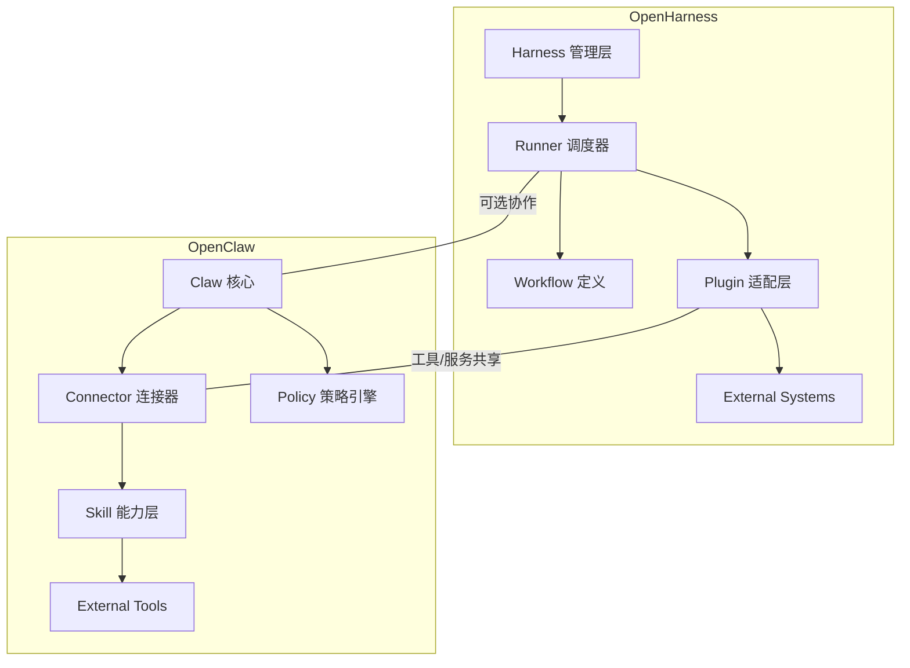
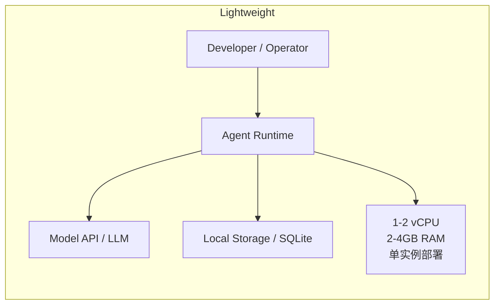
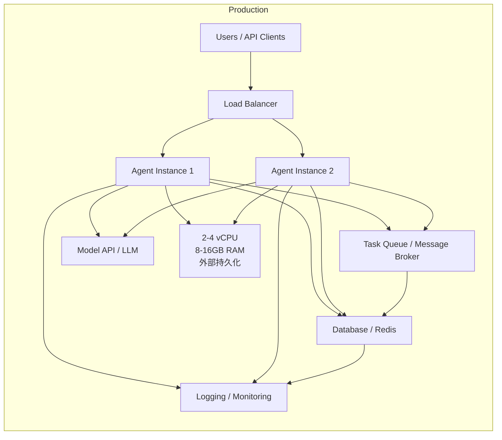
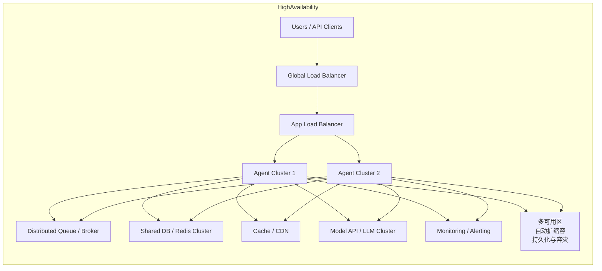

本文对比 `OpenHarness` 与 `OpenClaw` 两类开源 AI Agent 框架的设计理念、组件划分和集成方式，并通过 Mermaid 展示它们的架构图。

## 1. 核心对比

| 维度 | OpenHarness | OpenClaw |
| --- | --- | --- |
| 目标场景 | 任务编排与流程驱动 | 工具链集成与插件化执行 |
| 核心组件 | Harness、Runner、Plugin、Workflow | Claw 核心、Connector、Skill、Policy |
| 技能集成 | 通过 Plugin/Adapter 绑定外部工具 | 通过 Skill 定义能力，Connector 负责接入 |
| 配置方式 | YAML/JSON Workflow + 生命周期钩子 | YAML/JSON Skill + Policy 规则 |
| 执行模式 | 以“任务流”为中心，顺序或条件调度 | 以“工具调用”为中心，按需调度执行 |
| 可扩展性 | 更适合复杂场景编排 | 更适合多源工具融合 |

## 2. 设计与实现差异

### 2.1 OpenHarness

OpenHarness 倾向于将复杂流程拆解为若干可复用的步骤，并通过 Workflow 定义处理链路。它通常包括：

- **Harness**：管理整体任务生命周期。
- **Runner**：负责调度和执行每个工作单元。
- **Plugin**：将外部系统或第三方服务接入 Agent。
- **Workflow**：定义任务执行顺序、条件分支和重试策略。

这种设计适合多步骤、跨系统的业务编排，例如“代码审查 -> 依赖扫描 -> 部署验证”。

### 2.2 OpenClaw

OpenClaw 更强调对“能力”的封装与组合。典型组件包括：

- **Claw 核心**：调度请求并管理调用上下文。
- **Connector**：负责接入外部数据源或服务。
- **Skill**：描述具体能力，如“代码补全”、“测试生成”、“静态分析”。
- **Policy**：定义何时触发、权限与约束。

这种方式更适合把多个工具和模型能力组合成“智能助手”，并在运行时按需调用。

## 3. 架构对比

下面的架构图展示了两者在组件层面的差异：

## 4. 技术实现与资源需求

### 4.1 OpenHarness 技术实现

OpenHarness 的实现通常基于 Node.js / Python / Go 这类通用后端框架，核心模块包括：

- **Workflow 引擎**：解析 YAML/JSON 定义，构建任务 DAG 或状态机。
- **任务调度**：通过 Runner 执行任务节点，支持串行、并行、条件分支和重试。
- **插件扩展**：Plugin 作为适配层封装外部 API、CLI 或第三方服务。
- **状态管理**：记录任务执行结果、日志和上下文变量，方便回溯与重跑。

实现难度中等偏上，适合团队已有自动化框架基础时快速落地。

### 4.2 OpenClaw 技术实现

OpenClaw 的实现更侧重于能力层与工具接入，典型实现要点：

- **Connector 定义**：封装对外部系统的 API、数据库、消息通道的接入逻辑。
- **Skill 抽象**：定义“能力接口”，将具体执行逻辑与模型调用分离。
- **Policy 决策**：通过规则引擎判断何时触发某个 Skill，以及安全/权限限制。
- **上下文管理**：为每次对话或执行请求维护共享上下文，保证多轮调用的一致性。

OpenClaw 实现更适合希望形成“能力池”与“工具网关”的项目。

### 4.3 代码量与运行资源

这两类框架的代码量和资源需求通常由业务复杂度决定：

- **最小可用版本**：约 1k-3k 行代码，可实现基本任务流或 Skill 调度。
- **标准版本**：约 5k-15k 行代码，包含插件系统、持久化、日志、重试、权限、监控等完整能力。
- **企业级版本**：20k+ 行代码，支持多租户、分布式调度、审计、UI 可视化、复杂策略引擎。

运行资源建议：

- **轻量部署**：1-2 核 CPU + 2-4GB 内存，可支撑小规模测试、开发和低并发场景。
- **生产部署**：2-4 核 CPU + 8-16GB 内存，外加独立 Redis/数据库、对象存储和日志系统，适合中等并发。
- **高可用部署**：多实例、水平扩展、负载均衡、任务队列和持久化后端，适合企业级使用。

### 4.4 通信网关支持

这两类框架通常通过 Connector/Plugin 方式支持常见通信网关。典型支持项包括：

- **企业微信 / 飞书**：通过 Webhook、机器人 API 或事件订阅接入，支持消息接收、指令下发、审批通知。
- **Telegram**：通过 Bot API 接收用户消息，并将命令转发到 Agent，再把结果返回给聊天窗口。
- **Slack**：通过 Slack App、Events API、Interactivity 或 Slash Command 方式集成，支持消息、按钮交互和文件上传。
- **邮件 / Teams / Discord 等**：同样可通过标准 Connector 封装为输入/输出通道。

在 OpenHarness 中，这类网关通常作为外部触发源或结果通知目标；在 OpenClaw 中，则作为能力入口和多通道交互层。

## 5. 部署架构图

### 5.1 轻量部署

### 5.2 生产部署

### 5.3 高可用部署

## 6. 应用场景建议

- 如果你的项目侧重“多步骤任务编排、流程自动化和执行链路管理”，`OpenHarness` 更适合。
- 如果你需要“将多个能力模块化、按需调用并与外部工具深度融合”，`OpenClaw` 则更契合。

## 6. 结论

`OpenHarness` 与 `OpenClaw` 都属于开放式 Agent 生态，但它们关注点不同：前者偏业务流程与编排，后者偏能力模块与工具接入。通过统一架构视图，可以更快速判断哪种框架适合你的项目。