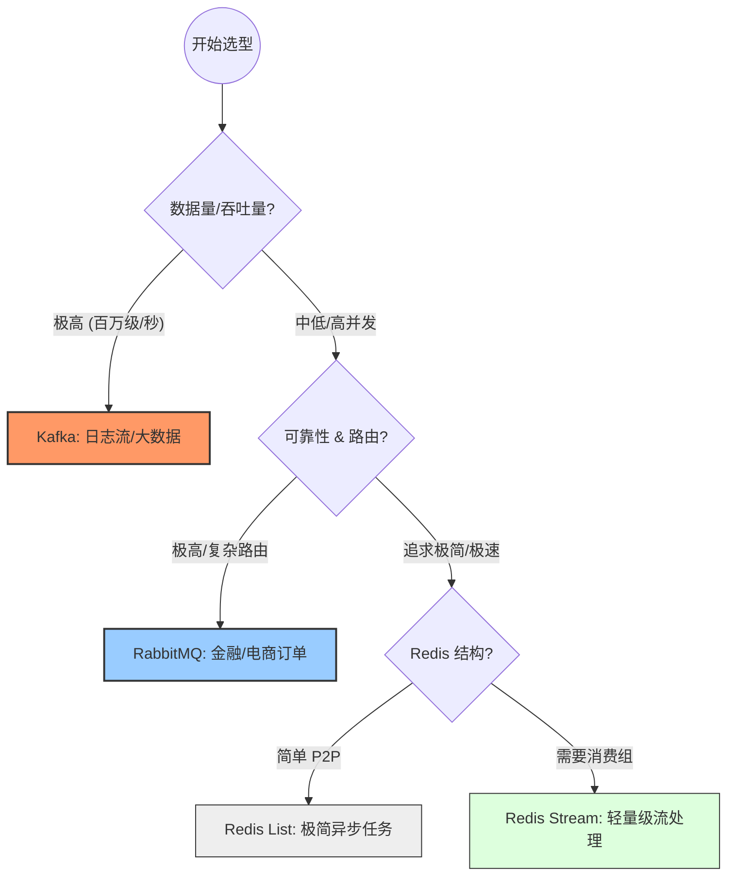

这是一份针对 **Redis List / Stream**、**RabbitMQ** 与 **Kafka** 的技术选型深度对比文档。这份文档旨在帮助架构师根据业务场景的复杂度和吞吐量要求做出决策。

---

## 消息队列技术选型对比文档 (2026版)

### 1. 核心定位

* **Redis List:** 简单的内存双向链表，常用于极简的异步任务处理。
* **Redis Stream:** 借鉴了 Kafka 设计的内存流数据结构，支持消费组和消息持久化。
* **RabbitMQ:** 遵循 AMQP 协议的专业消息中间件，强调可靠性、路由灵活性和事务。
* **Kafka:** 分布式流处理平台，专为高吞吐日志采集和实时数据流设计。

---

### 2. 关键维度对比表

| 特性 | Redis List | Redis Stream | RabbitMQ | Kafka |
| --- | --- | --- | --- | --- |
| **设计哲学** | 简单队列 | 轻量级流处理 | **专业路由控制** | **高吞吐日志流** |
| **消息路由** | Key 匹配 (P2P) | Key 匹配 | **极强 (Exchange)** | 分区路由 (Partition) |
| **持久化** | 依赖 RDB/AOF | 较好 (支持 AOF) | 完善 (磁盘持久化) | **原生磁盘持久化** |
| **消费模型** | 竞争消费 (取走即删) | 消费组 (支持回溯) | 竞争消费 (ACK后删) | **拉模式 (组播/回溯)** |
| **并发能力** | 1万~10万级 | 10万级 | 1万~5万级 | **100万级+** |
| **消息堆积** | 极差 (内存溢出) | 一般 (受内存限制) | 一般 (影响性能) | **优秀 (磁盘上限)** |
| **分布式能力** | 无原生分布式语义，仅通过 Redis Cluster Key 分片 | 有限：Stream key 仍在单槽，消费组不跨槽 | 支持集群与镜像队列，需处理一致性与网络分区 | **原生分区 + 副本 + 消费组** |
| **运维成本** | 极低 | 极低 | 中等 | 高 (需管理集群) |

---

### 3. 场景建议

* **选 Redis List:** 业务极其简单，如：发送验证码邮件、异步更新计数器。
* **选 Redis Stream:** 需要消息回溯或消费组功能，但数据量在内存可控范围内。
* **选 RabbitMQ:** 核心业务逻辑，如：**订单系统、支付流程**。需要确保消息 100% 不丢且路由逻辑复杂。
* **选 Kafka:** 大数据分析，如：**用户行为追踪、ELK 日志采集、监控指标流**。也可以用于支付数据+金融数据，因为：顺序追加日志 + 分布式副本

---

### 4. 选型思维导图 (Mermaid)

---

### 5. 架构师视角：深度差异点

#### **5.1 消息路由和消费模型对比**

**消息路由实现方式：**

| 技术 | 路由机制 | 实现原理 | 使用场景 |
| --- | --- | --- | --- |
| **Redis List** | 直接 Key 匹配 (P2P) | 生产者写入指定 Key，消费者从 Key 读取 | 简单一对一队列，如邮件发送 |
| **Redis Stream** | Stream ID + 消费组 | 消息写入 Stream，消费者通过消费组追踪偏移量 | 需要消息回溯的场景，轻量日志流 |
| **RabbitMQ** | Exchange + Binding + Queue | 生产者发送到 Exchange，Exchange 通过 routing key 路由到 Queue | 复杂路由规则，如订单系统的多条链路 |
| **Kafka** | Partition + Topic | 生产者根据 Partition Key 选择分区，消费者订阅 Topic | 高吞吐数据流，同一 Partition Key 的消息同分区有序 |

**消费模型详解：**

* **Redis List (竞争消费/取走即删):**
  - 原理：`LPOP` 或 `RPOP` 直接从队列取出消息，消息立即删除
  - 特点：简单、快速，但无消息堆积空间，无消费历史回溯
  - 风险：消费失败无重试机制，消息易丢失
  - 适用：异步邮件、计数器更新等一次性任务

* **Redis Stream Redis 5.0引入(消费组/支持回溯):**
  - 原理：消息持久化存储，消费组维护消费位置 (`last_delivered_id`)，支持 `XREAD` 和 `XREADGROUP`
  - 特点：可重复消费、消息不删除、支持多消费者分工
  - 风险：内存有限，大量堆积会导致 Redis 内存溢出；无分布式扩展
  - 适用：需要回溯的轻量日志、金融交易回放

* **RabbitMQ (Push 模式 + ACK 确认):**
  - 原理：服务器主动推送消息给消费者，消费者处理后返回 ACK
  - 优点：实时性高，服务器控制速率；支持死信队列和重试
  - 缺点：消费者处理慢时容易堆积；推送过快会压垮消费者 (backpressure 问题)
  - 路由灵活性：
    - **Direct Exchange:** 精确 routing key 匹配 (1:1)
    - **Fanout Exchange:** 广播到所有绑定的 Queue (1:N)
    - **Topic Exchange:** 通配符匹配 routing key (如 `order.*.created`)
    - **Headers Exchange:** 基于消息头属性路由
  - 适用：金融订单、支付流程，需要 100% 不丢

* **Kafka (Pull 模式 + Offset 管理):**
  - 原理：消费者主动拉取消息，Broker 记录消费进度 (Offset)
  - 优点：消费者自主控制速率，天然支持批量消费；高吞吐
  - Offset 管理：
    - **自动提交:** 消费后自动更新 Offset，可能丢消息 (处理中若宕机)
    - **手动提交:** 消费完全成功后手动提交，保证至少消费一次
  - 有序性保证：相同 Partition Key 的消息分配到同一 Partition，同 Partition 内严格有序。Partition Key（分区键） 的选取直接决定了数据的分布均匀性（是否产生倾斜）和处理顺序性。Partition Key通过哈希算法（通常是 murmur2）将消息映射到特定的分区。因此Partition Key选择选取业务中最小的逻辑单元 ID，如 user_id、order_id 或 device_id。
  - 适用：大数据日志流、实时数据分析、ELK 日志采集

* **分布式能力对比：**
  - **Redis List:** 无原生分布式队列语义，仅能通过 Redis Cluster 的 Key 分片来分散负载；跨节点消费仍需应用层路由。
  - **Redis Stream:** 可以部署在 Redis Cluster，但一个 Stream key 仍属于单个 slot，消费组也不能跨槽；适合单 key 规模扩展，跨节点扩展能力有限。
  - **RabbitMQ:** 支持集群、镜像队列、联邦和 shovel；适合多节点部署，但需处理队列 leader 选举、网络分区和一致性复杂性。
  - **Kafka:** 原生分布式平台，Topic 分区跨 broker，副本机制提供容错，消费组天然分布式；四者中分布式能力最强。

#### **5.2 有序性保证**

* **Redis/RabbitMQ:** 在单队列情况下是有序的，但在高并发多消费者环境下，很难保证处理完成的顺序。
* **Kafka:** 通过 **Partition Key** 将相同属性的消息发往同一分区，在分区级别提供严格的顺序性。

#### **5.3 生态集成**

* 如果你在构建 **K3s 集群**并需要处理大量 Pod 日志，**Kafka** 与 Fluentd/Logstash 的集成是工业标准的。
* 如果你在写 **Python FastAPI/Dify Agent** 且已经启用了 Redis 容器，直接用 **Redis Stream** 可以让你在 5 分钟内完成异步链路开发。