# 深入理解 RabbitMQ

RabbitMQ 是目前最受欢迎的**开源消息代理中间件**，它实现了 **AMQP (Advanced Message Queuing Protocol)** 协议，以**可靠性、路由灵活性和功能丰富性**著称。从金融支付、电商订单到微服务异步解耦，RabbitMQ 是追求消息 100% 不丢失场景的首选。

以下从 AMQP 协议模型、核心路由机制，到生产级部署与分布式高可用方案，为你进行全面拆解。

---

## 1. 基础概念：AMQP 协议模型

RabbitMQ 的核心设计围绕 AMQP 0-9-1 协议展开。要理解 RabbitMQ，首先要厘清其独特的消息路由模型——与"生产者直接发送到队列"的直觉不同，RabbitMQ 引入了 **Exchange（交换机）** 作为中间路由层。

### AMQP 核心组件

| 组件 | 职责 | 类比 |
| --- | --- | --- |
| **Producer** | 生产者，发送消息的应用 | 寄信人 |
| **Consumer** | 消费者，接收消息的应用 | 收信人 |
| **Broker** | RabbitMQ 服务器，接收和路由消息 | 邮局总部 |
| **Connection** | 生产者/消费者与 Broker 的 TCP 连接 | 邮局专线 |
| **Channel** | 连接内的虚拟通道，AMQP 命令通过 Channel 发送，每个 Channel 有唯一 ID | 专线内的分机 |
| **Exchange** | 交换机，接收生产者消息并路由到一个或多个队列 | 分拣中心 |
| **Queue** | 队列，存储消息等待消费者拉取 | 信箱 |
| **Binding** | 绑定，定义 Exchange 与 Queue 之间的路由规则 | 投递规则 |
| **Routing Key** | 路由键，生产者发送消息时附带的路由标识 | 信封上的地址 |
| **Virtual Host (vhost)** | 虚拟主机，隔离的命名空间，类似数据库 | 分区域管理的邮局 |

### 消息流转全景

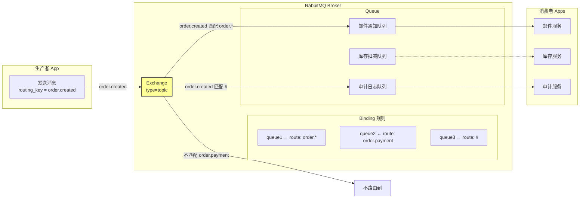

---

## 2. 核心架构：四种 Exchange 路由机制

Exchange 是 RabbitMQ 的灵魂，它决定了消息如何从生产者流向队列。RabbitMQ 提供了四种 Exchange 类型，覆盖从简单到复杂的所有路由需求。

### 2.1 Direct Exchange：精确匹配

Direct Exchange 会将消息的 `routing_key` 与 Binding 的 `binding_key` **精确匹配**。

| 属性 | 说明 |
| --- | --- |
| **匹配规则** | routing_key 必须与 binding_key 完全相等 |
| **常见用途** | 点对点通信、基于特定条件的精准路由 |
| **示例** | `error` 队列只接收 routing_key 为 `error` 的消息 |

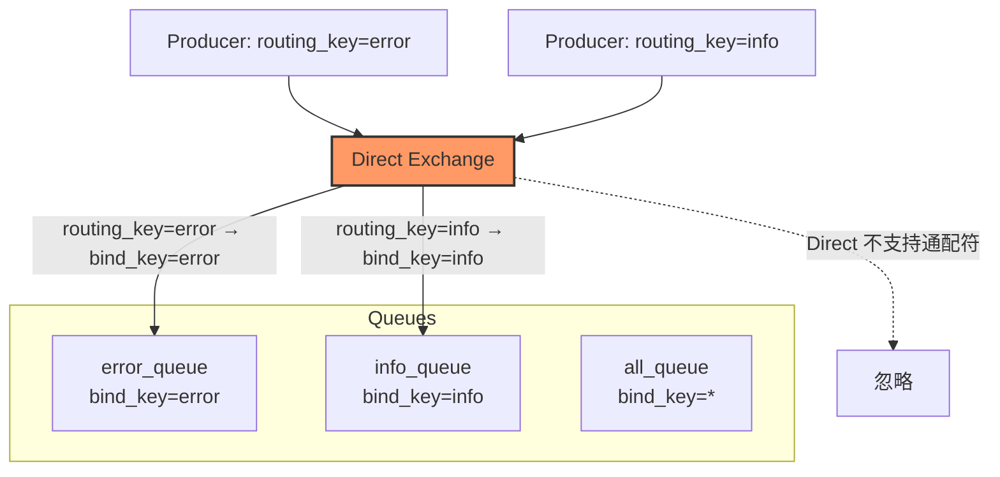

### 2.2 Fanout Exchange：广播模式

Fanout Exchange **忽略 routing_key**，将消息广播到所有绑定的队列。

| 属性 | 说明 |
| --- | --- |
| **匹配规则** | 完全忽略 routing_key，所有绑定队列都会收到消息 |
| **常见用途** | 通知/广播、缓存失效、实时状态推送 |
| **示例** | 订单创建后同时通知邮件、短信、库存、物流服务 |

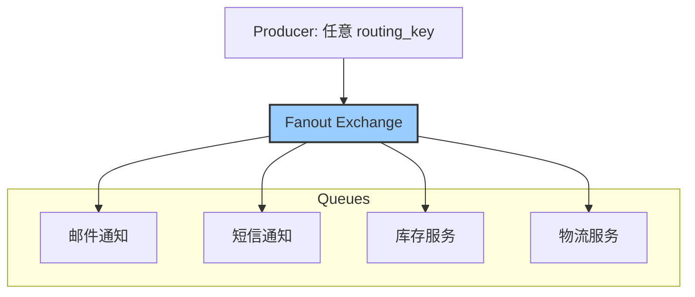

### 2.3 Topic Exchange：通配符匹配（最灵活）

Topic Exchange 支持基于 **点分 + 通配符** 的路由模式，是功能最强、使用最广泛的 Exchange 类型。

| 通配符 | 含义 | 示例 |
| --- | --- | --- |
| `*` | 匹配**恰好一个**单词 | `order.*` 匹配 `order.created`，但不匹配 `order.cn.created` |
| `#` | 匹配**零个或多个**单词 | `order.#` 匹配 `order.created`、`order.cn.shop.123`、`order` |

#### 场景示例：订单系统路由

假设我们有一个电商订单系统，定义了以下 **4 条 Binding 规则**：

| 队列 | Binding Key | 用途 |
| --- | --- | --- |
| Q1 邮件队列 | `order.*.created` | 只关心"订单创建"事件，不管哪个渠道 |
| Q2 支付队列 | `order.payment.*` | 只关心支付相关的所有事件 |
| Q3 审计日志 | `*.audit.*` | 只关心审计类事件 |
| Q4 所有订单 | `order.#` | 关心所有订单相关事件 |

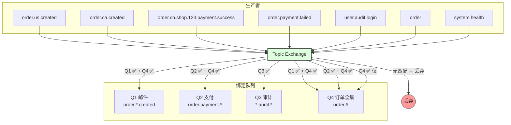

#### 路由键匹配详解

下表列出了 **8 个贴近生产的 routing key**（多地域、多级订单、支付回调、审计日志等场景），以及它们最终会路由到哪些队列：

| # | Producer 发送的 Routing Key | Q1: `order.*.created` | Q2: `order.payment.*` | Q3: `*.audit.*` | Q4: `order.#` | 最终投递到 |
| --- | --- | --- | --- | --- | --- | --- |
| 1 | `order.us.created` | ✅ * = us | ❌ | ❌ | ✅ | **Q1, Q4** |
| 2 | `order.ca.created` | ✅ * = ca | ❌ | ❌ | ✅ | **Q1, Q4** |
| 3 | `order.cn.shop.123.created` | ❌（三层单词，`order.*.created` 要求恰好两层中间词） | ❌ | ❌ | ✅ `order.#` 匹配任意多层 | **Q4 仅** |
| 4 | `order.cn.shop.123.payment.success` | ❌ | ❌（中间词是 shop.123.payment 而非 payment） | ❌ | ✅ `order.#` 吞噬一切 | **Q4 仅** |
| 5 | `order.payment.success` | ❌（success ≠ created） | ✅ * = success | ❌ | ✅ | **Q2, Q4** |
| 6 | `order.payment.failed` | ❌ | ✅ * = failed | ❌ | ✅ | **Q2, Q4** |
| 7 | `user.audit.login` | ❌ | ❌ | ✅ * = user, * = login | ❌（user ≠ order） | **Q3 仅** |
| 8 | `system.health` | ❌ | ❌ | ❌ | ❌ | **丢弃** |

#### 从上面看出的生产实战结论

* **第 1、2 条**：`order.us.created`、`order.ca.created` 这类**固定三层结构**的 routing key，完美命中 `order.*.created` —— 这是 Topic Exchange 最常见的用法，`*` 就是那个可变字段（国家代码、渠道、店铺类型等）
* **第 3、4 条**：一旦 routing key 变成**四层以上**（如 `order.cn.shop.123.created`），`order.*.created` 就**匹配不上了**——因为 `*` 只能恰好匹配一个单词。此时只有 `order.#` 能接住，这就是 `#` 存在的意义
* **第 5、6 条**：`order.payment.success` 和 `order.payment.failed` 既命中了 `order.payment.*` 也命中了 `order.#`——**同一条消息可以同时投递多个队列**（Q2 处理支付逻辑，Q4 做全量归档）
* **第 7 条**：`user.audit.login` 虽然不是 order 领域的事件，但 `*.audit.*` 通配符照样能接住——**审计/监控这类跨领域事件最适合用 `*` 做前后通配**
* **第 8 条**：完全不在关注范围内的事件直接被丢弃，不会对任何队列造成干扰
* **第 3、4 条启示**：如果你的 routing key 结构不固定（有时三层有时四层），`*` 就不够用了，要用 `#` 来覆盖可变层级。但这也意味着 `#` 会匹配**所有**东西，可能导致你的"全量队列"消息爆炸

#### 匹配规则要点

* **一条消息可以同时投递到多个队列**（如第 1、2、5、6 条同时命中两个队列），这是 Topic Exchange 最强大的地方——一次发送，多处消费
* **`#` 匹配范围最广**，`order.#` 甚至能匹配裸 `order`（`#` 可以匹配零个单词），也能匹配任意多层 `order.cn.shop.123.payment.success`
* **没有任何 Binding 匹配的消息会被丢弃**（除非配置了备用 Exchange Alternate Exchange）
* **`*` 和 `#` 的边界区别**：`order.*.created` 只能匹配恰好三层（如 `order.us.created`），`order.#.created` 才能匹配多层（如 `order.cn.shop.123.created`）——这是生产中最容易踩的坑

### 2.4 Headers Exchange：基于消息头路由

Headers Exchange **忽略 routing_key**，转而根据消息的 **Headers 属性**进行匹配。

| 属性 | 说明 |
| --- | --- |
| **匹配依据** | 消息头中指定的键值对 |
| **x-match** | `all` 表示所有匹配项都要满足，`any` 表示满足任一即可 |
| **适用场景** | 消息路由逻辑不在路由键中，而在消息头中的场景 |

> **实际使用建议：** Headers Exchange 性能较差且不够直观，生产中很少使用。优先使用 Direct 或 Topic。

---

## 3. 核心特性：可靠性与消息安全

RabbitMQ 的核心竞争力在于其**全套的消息可靠性保障机制**，确保消息"不丢、不重、可回"。

### 3.1 生产者可靠性

生产者发送消息可能因网络抖动丢失，RabbitMQ 提供两种确认机制：

| 机制 | 原理 | 适用场景 |
| --- | --- | --- |
| **事务（Tx）** | 将 `channel` 设置为事务模式（`txSelect`），发送后等待 `txCommit` 或 `txRollback` | 简单可靠，但性能差（TPS 降低约 10 倍） |
| **Publisher Confirm** | 开启 `confirmSelect`，Broker 收到消息后异步回调通知生产者 | **推荐方案**，性能好、异步非阻塞 |

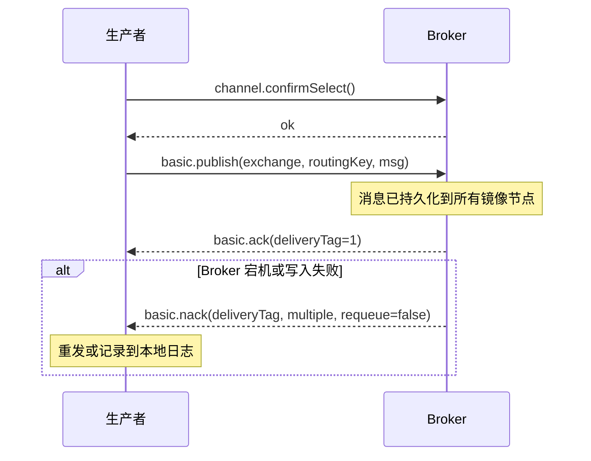

### 3.2 队列与消息持久化

消息丢失的另一个风险是 Broker 重启。需要三层持久化：

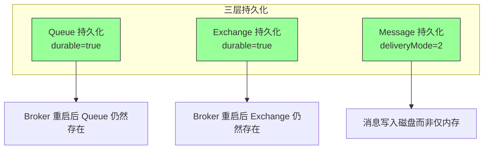

### 3.3 消费者可靠性：ACK 机制

消费者收到消息后的**确认（Acknowledgement）**模式是保障消息不丢的关键：

| ACK 模式 | 行为 | 风险 | 适用场景 |
| --- | --- | --- | --- |
| **自动 ACK（auto-ack）** | Broker 推送消息后立即删除，不管消费者处理结果 | 消费者处理失败 → 消息丢失 | 对可靠性无要求的场景 |
| **手动 ACK（manual-ack）** | 消费者处理完后显式调用 `basic.ack` 确认 | 消费者处理完但 ACK 前宕机 → 消息重投 | **推荐**，需要精确控制的场景 |
| **NACK / Reject** | 消费者显式拒绝消息，可选择是否 requeue | — | 处理失败时决定重试还是丢弃 |

#### 手动 ACK 流程详解

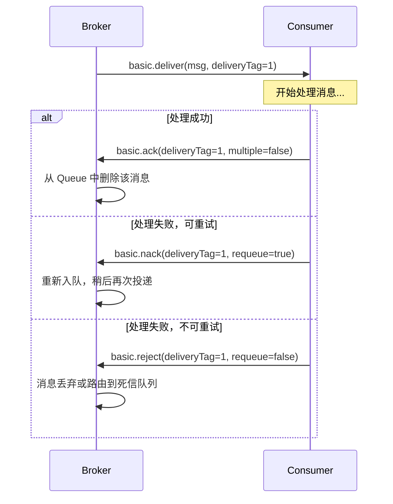

### 3.4 死信队列（Dead Letter Queue, DLX）

当消息变成"死信"时，RabbitMQ 会自动将其路由到指定的死信 Exchange：

**死信产生条件：**
1. 消费者**拒绝**了消息且未指定 requeue
2. 消息**过期**（TTL 到期）且无法正常投递
3. 队列达到**最大长度**，新消息被丢弃
4. `basic.reject` 或 `basic.nack` 配合 `requeue=false`

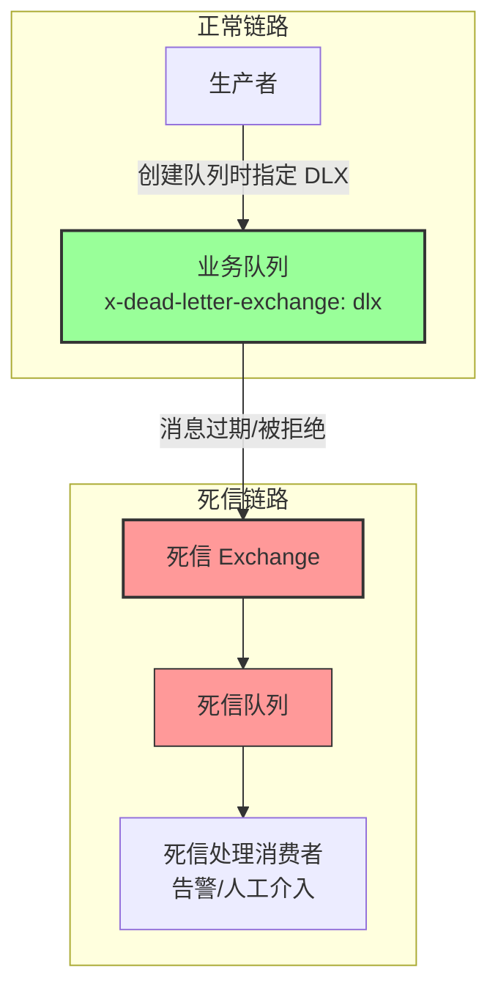

#### 经典应用：延迟队列

利用 RabbitMQ 的 TTL + 死信队列，可以实现**延迟执行**：

```
生产者 → 过期队列（TTL=10min, DLX 指向真正的业务 Exchange）→ 到期后自动路由 → 业务队列 → 消费者
```

> RabbitMQ 3.6+ 还支持 **rabbitmq_delayed_message_exchange** 插件，这是更优雅的延迟队列方案。

---

## 4. 队列高级特性

### 4.1 优先级队列

RabbitMQ 原生支持**消息优先级**，高优先级的消息会排在前面被消费：

* 声明队列时设置 `x-max-priority` 参数（1~10）
* 发送消息时设置 `priority` 字段

### 4.2 消息持久化 + TTL

* **整条队列过期：** `x-expires: 3600000`（毫秒），队列 1 小时无消息后自动删除
* **单条消息过期：** `message TTL`（`expiration` 属性），超过指定时间后变成死信

### 4.3 限流控制（QoS / Prefetch）

消费者可以设置**预取数量（prefetch_count）**，限制 Broker 一次性推送的未确认消息数量：

```java
// 消费者最多同时处理 10 条未确认消息
channel.basicQos(10);
```

> **重要：** 如果 prefetch_count 设置过大，消费者处理慢时会导致大量消息堆积在 Broker 内存中；如果设置过小，消息吞吐会受限。建议根据消费者实际处理能力调优。

---

## 5. 分布式实现：四种高可用方案

RabbitMQ 提供了多层次的分布式能力，从简单的镜像队列到跨地域联邦，覆盖不同规模的生产需求。

### 5.1 集群（Cluster）：多节点共享数据

RabbitMQ Cluster 将多个节点组织在一起，共享元数据（Exchange、Queue、Binding），但**消息数据只存储在创建它的节点上**。

| 特性 | 说明 |
| --- | --- |
| **节点类型** | 内存节点（RAM Node，元数据存内存，快）和磁盘节点（Disk Node，元数据存磁盘） |
| **镜像队列（Classic Mirroring）** | 配置策略后，队列可以镜像到多个节点，消息同时写入主+镜像 |
| **元数据同步** | 使用 Mnesia（内置 Erlang 数据库）同步 |
| **节点故障** | 镜像节点自动接管主队列 |

**架构示意：**

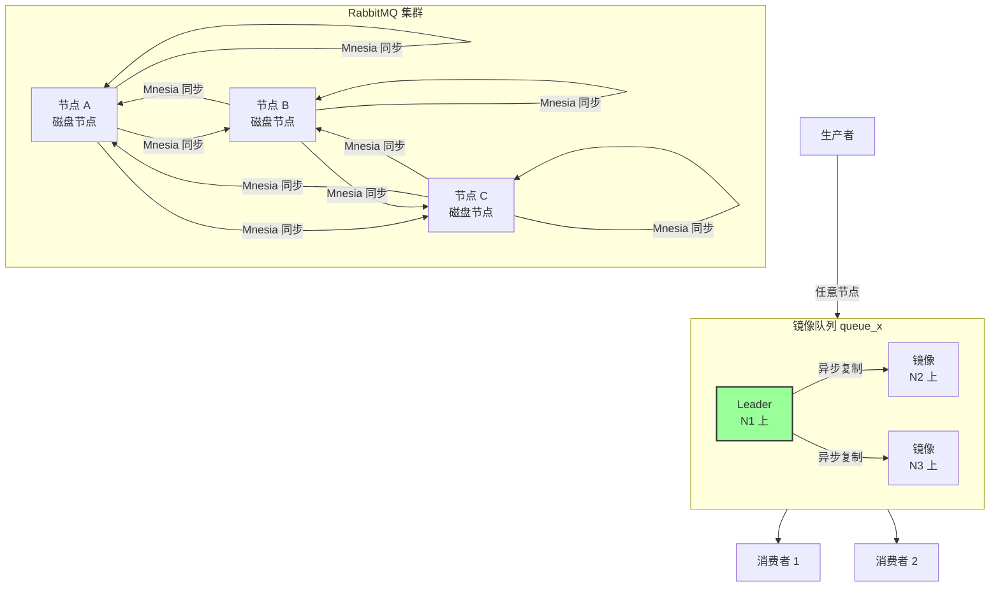

**镜像队列的坑：**
* 消息同步是**异步**的，主节点刚写完就挂，镜像节点可能还没收到 → 消息丢失
* 所有镜像节点都可能宕机 → 整个队列不可用
* 高流量下，镜像同步会增加网络 I/O，降低吞吐

### 5.2 Quorum Queue：基于 Raft 的强一致性队列

RabbitMQ 3.8 引入的 **Quorum Queue** 是镜像队列的进化版，它基于 **Raft 一致性协议**提供**强一致性、自动故障转移**。

| 维度 | Classic Mirroring | Quorum Queue |
| --- | --- | --- |
| **一致性协议** | 无，异步复制 | Raft（强一致性） |
| **写入确认** | 主节点确认即可 | 多数派确认后才回复客户端 |
| **故障转移** | 手动或自动选举 | Raft Leader 自动恢复（毫秒级） |
| **网络分区** | 可能脑裂 | Raft 自动选主，防脑裂 |
| **性能** | 高 | 略低（多数派确认有开销） |
| **推荐场景** | 允许短暂数据不一致 | **生产首选**，核心业务 |

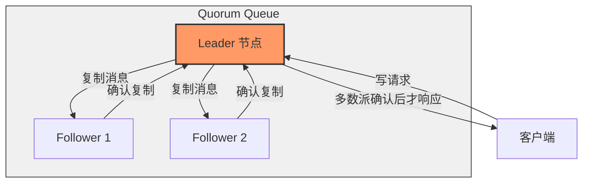

### 5.3 Federation：跨集群松耦合复制

当你需要连接**两个独立集群**（如跨地域、跨租户）时，Federation 提供了**松耦合的单向或双向消息复制**。

| 特性 | 说明 |
| --- | --- |
| **工作方式** | 一个 Broker 从另一个 Broker 拉取消息，本地转发 |
| **适用场景** | 跨地域机房的消息流通、连接不受信任的外部系统 |
| **优点** | 解耦、故障隔离、支持不同版本 RabbitMQ 互联 |
| **缺点** | 延迟较高、不是强一致 |

### 5.4 Shovel：可配置的消息搬运工

Shovel 是**数据层面的消息复制工具**，可以将一个队列的消息**搬运**到另一个 Exchange 或 Queue，支持跨集群、跨 VHost。

| 特性 | 说明 |
| --- | --- |
| **连接方式** | 双端都是 AMQP 连接 |
| **复制粒度** | 消息级别（比 Exchange 级别更精细） |
| **适用场景** | 数据迁移、消息归档到另一个集群、跨地域容灾 |
| **与 Federation 对比** | Federation 操作 Exchange 路由，Shovel 操作 Queue 内容 |

### 5.5 Stream Queue：基于日志的高性能队列（吞吐 + HA 双提升）

> **前置要求：** RabbitMQ 3.9+ 可用，3.12+ 成为一等公民。需要启用 `rabbitmq_stream` 插件。

Stream Queue 是 RabbitMQ 继 Quorum Queue 之后最重要的架构升级，它彻底抛弃了传统队列的"随机读写"模型，转而采用**类 Kafka 的追加写入日志（Append-Only Log）**存储引擎。

#### 存储引擎对比

| 维度 | Classic / Quorum Queue | Stream Queue |
| --- | --- | --- |
| **写入方式** | 随机写（每条消息更新索引 + 写消息体） | 顺序追加写日志文件 |
| **磁盘 I/O** | 高随机 IOPS 依赖 | 低，顺序写吞吐量接近磁盘上限 |
| **消费模型** | ACK 确认后消息删除 | 基于 Offset，消息持久化保留可回溯 |
| **副本复制** | 同步/异步复制完整消息 | Raft 复制日志段（批量高效） |
| **适合场景** | 单条消息确认、任务型队列 | 高吞吐事件流、消息回放、多消费者组 |

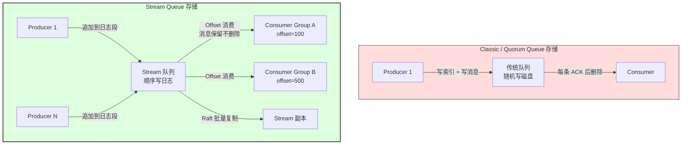

#### 核心特性

| 特性 | 说明 |
| --- | --- |
| **高吞吐** | 顺序写消除了随机写瓶颈，单机吞吐可达 **10 万+ msg/s**（Quorum Queue 约 2-3 万） |
| **基于 Offset 消费** | 消费者从指定 offset 开始消费，断开重连后可从上次位置恢复 |
| **消息回放** | 消息写入后保留在日志中（可配置保留策略），新的消费者组可以重新消费历史数据 |
| **多消费者组** | 同一 Stream 可以被多个独立的 Consumer Group 订阅，各自维护 offset |
| **Raft 强一致** | 副本同步基于 Raft，自动选主，与 Quorum Queue 同级别的 HA |
| **磁盘自动清理** | 可按时间或大小设置日志段的保留策略，超出自动删除旧段 |

#### 消费模型的区别：Offset vs ACK

传统队列是 **"拉即删"** 模型——消息被一个消费者拉取后，其他消费者就看不到了（Pub/Sub 模式下 Fanout Exchange 会复制到多个队列）。

Stream Queue 是 **"日志 + Offset"** 模型——所有消息都保留在日志中，每个 Consumer Group 独立维护自己的消费进度（offset），天然支持多订阅者。

| 对比项 | Classic / Quorum | Stream |
| --- | --- | --- |
| 消息生命周期 | 被 ACK 后即删除 | 持久保留，按策略清理 |
| 多消费者 | 每个消费者独占消息（需 Fanout 复制） | 天然支持多 Consumer Group，独立 offset |
| 故障恢复 | NACK + requeue 或重投 | 重连后从 offset 继续 |
| 消息顺序 | 单消费者有序 | 同一 stream 内全局有序 |
| 跨组广播 | 需要 Fanout Exchange | 不需要，直接多 Group 订阅 |

### 各分布式方案对吞吐与高可用的影响

这是很多人关心的核心问题——**引入这些方案后，系统到底变快了还是只是更能扛了？**

| 方案 | **吞吐影响** | **高可用影响** | 说明 |
| --- | --- | --- | --- |
| **Classic Mirroring** | ⬇️ **略降**（镜像同步增加网络开销） | ✅ 提升（主节点挂，镜像接管） | 同步复制时每条消息都要发往镜像，异步复制可能丢消息。HA 有，吞吐略损 |
| **Quorum Queue** | ⬇️ **明显下降**（多数派确认 RTT） | ✅✅ 大幅提升（Raft 强一致 + 自动选主） | 每次写入要等多数节点确认，吞吐从单机 5 万降到 2-3 万。**这是 HA 的代价** |
| **Federation** | ➡️ 不变（本地 Broker 自己的吞吐） | ➡️ 不提升（连接工具，不增强本地 HA） | Federation 只是"跨集群搬运"，本地 Broker 挂了照样挂 |
| **Shovel** | ➡️ 不变 | ➡️ 不提升 | 数据层面的搬运工，本身不提供 HA |
| **Stream Queue（单机）** | ⬆️ **大幅提升**（顺序写 → 10 万+ msg/s） | ➡️ 单机无 HA | 存储引擎从随机写变成顺序写，消除了磁盘 IO 瓶颈 |
| **Stream Queue（集群 Raft 复制）** | ⬆️ **仍高于 Quorum**（批量日志段复制） | ✅✅ 大幅提升（Raft + 自动选主） | Raft 复制的是**日志段**（批量），比 Quorum Queue 复制**单条消息**高效得多——这是唯一同时提升吞吐和 HA 的方案 |

> **核心结论：**
> * **Classic Mirroring、Quorum Queue** —— **只提升 HA，牺牲吞吐**，本质是用可靠性换性能
> * **Federation、Shovel** —— **既不提升吞吐也不提升 HA**，只是扩展连接能力的工具
> * **Stream Queue（集群模式）** —— **唯一同时提升吞吐 + HA 的方案**，因为它从底层存储引擎做了革新（顺序写 + 批量复制），而不是在传统存储上叠副本

### 分布式方案选型建议

| 需求 | 推荐方案 | 吞吐影响 | HA 影响 | 理由 |
| --- | --- | --- | --- | --- |
| **高吞吐 + 高可用**（首选） | **Stream Queue 集群** | ⬆️ 提升 | ✅✅ | 顺序写 + Raft 批量复制，唯一兼顾吞吐与可靠 |
| 单集群内强一致（历史项目） | **Quorum Queue** | ⬇️ 略降 | ✅✅ | Raft 强一致，自动选主，但吞吐有代价 |
| 跨地域/多集群互联 | **Federation / Shovel** | ➡️ 不变 | ➡️ 不变 | 松耦合、解耦、故障隔离 |
| 历史遗留系统 | Classic Mirroring | ⬇️ 略降 | ✅ | 兼容性好，但注意数据不一致风险 |
| 跨版本数据迁移 | Shovel | ➡️ 不变 | ➡️ 不变 | 安全搬运消息 |
| 高吞吐事件流（如日志） | Stream Queue（单机也可） | ⬆️ 提升 | ➡️ 单机无 | 顺序写消除 IO 瓶颈，消息可回放 |

---

## 6. 生产部署最佳实践

### 6.1 节点数量规划

| 集群规模 | 推荐配置 | 理由 |
| --- | --- | --- |
| **最小高可用** | 3 节点（2 磁盘 + 1 内存） | 多数派选举需要至少 2 个节点存活 |
| **大规模集群** | 5~7 磁盘节点 | 更多节点提升读写吞吐和容错能力 |
| **单机测试** | 单节点即可 | 不做镜像，简单快速 |

### 6.2 资源配置

| 维度 | 建议 |
| --- | --- |
| **内存** | 至少 4GB，生产建议 8GB+，超过 `vm_memory_high_watermark`（默认 0.4）会阻塞生产者 |
| **磁盘** | 使用 SSD，RabbitMQ 3.12+ 推荐 `stream` 队列类型（类 Kafka 的日志存储） |
| **网络** | 集群节点间建议走内网（低延迟、高带宽） |
| **Erlang 版本** | 使用 RabbitMQ 官方推荐的 Erlang/OTP 版本，兼容性很重要 |

### 6.3 监控与运维

| 监控项 | 工具/方法 |
| --- | --- |
| **管理 UI** | RabbitMQ 自带 Web 管理插件（`rabbitmq-management`） |
| **Prometheus 指标** | 启用 `rabbitmq-prometheus` 插件，配合 Grafana 看板 |
| **核心指标** | 队列深度（queue_depth）、预取数量、连接数、内存占用 |
| **报警** | 队列积压告警、镜像同步延迟告警、节点健康检查 |

### 6.4 容量规划公式

估算队列深度上限：
```
最大积压量 = (单消息平均大小) × (消费速率) × (最大允许宕机时间)
```

示例：消费速率 1000 msg/s，允许故障 10 分钟 = 600,000 条消息，每条平均 1KB → 需要约 600MB 存储空间。

---

## 7. 典型应用场景

| 场景 | RabbitMQ 核心价值 | 关键配置 |
| --- | --- | --- |
| **电商订单系统** | 异步解耦订单创建与支付/库存/物流 | Topic Exchange + 镜像队列 + 死信队列 |
| **金融支付流程** | 确保支付回调消息 100% 不丢 | Publisher Confirm + Quorum Queue |
| **微服务事件驱动** | 服务间松耦合通信 | Fanout Exchange + TTL 自动清理 |
| **日志收集** | 削峰填谷，保护下游 ELK | 高 prefetch_count + Stream Queue 类型 |
| **任务调度** | 定时任务/延迟执行 | TTL + 死信队列 或 delayed_message 插件 |
| **系统通知** | 邮件/短信/站内信异步发送 | Direct Exchange + 优先级队列（紧急消息优先） |

---

## 8. RabbitMQ vs 其他消息中间件

回到 [消息队列技术选型对比]() 的核心结论：

> **RabbitMQ 是需要"消息可靠、路由灵活、功能丰富"场景的首选。** 它的 Exchange + Binding 路由模型比 Kafka 的 Topic + Partition 更精细，Quorum Queue 比 Redis Stream 更可靠。但在**高吞吐大数据量**（百万级/秒）场景下，Kafka 仍是王者。

RabbitMQ 的哲学是**消息可靠性优先**，为此它牺牲了部分吞吐上限（单机约 5 万 QPS vs Kafka 的百万级）。这正是为什么金融、支付、电商等**不允许消息丢失**的业务，几乎都选择 RabbitMQ。