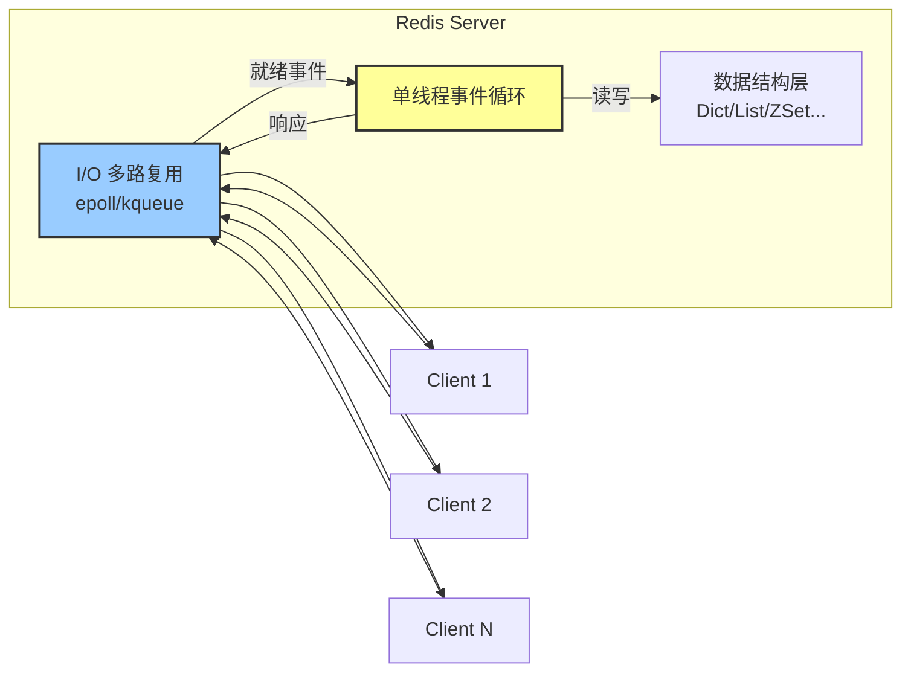
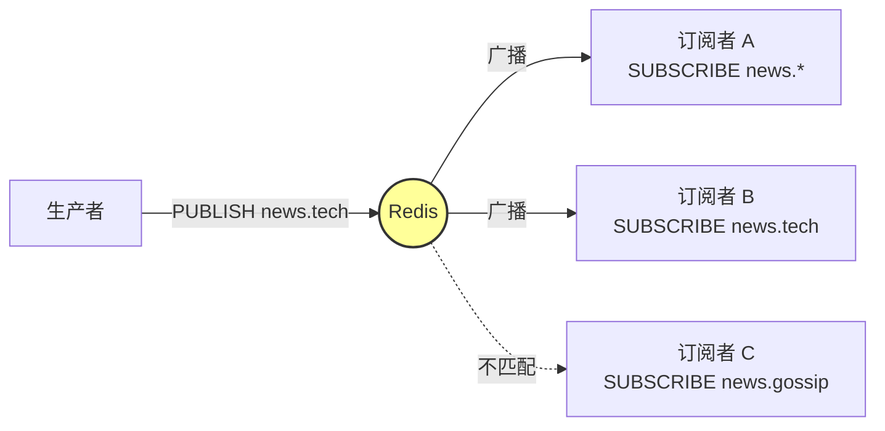
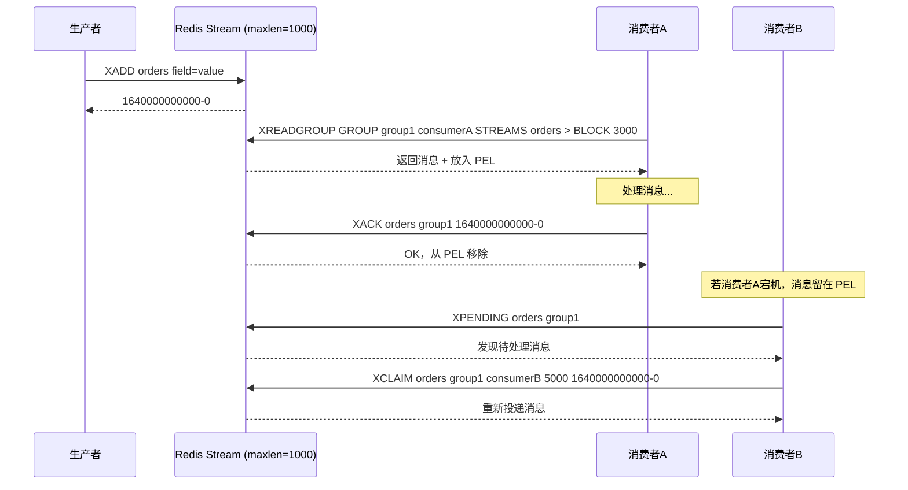
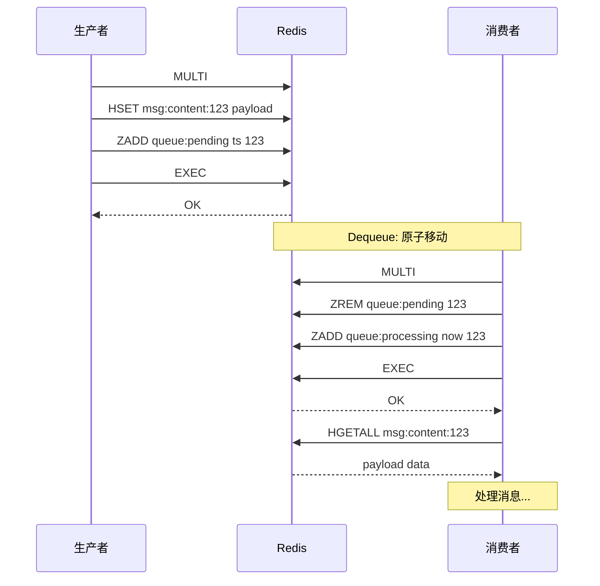
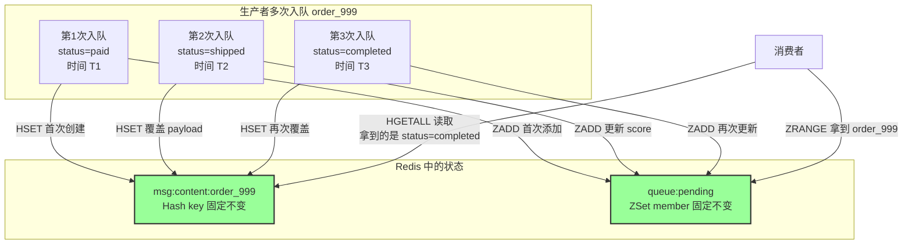
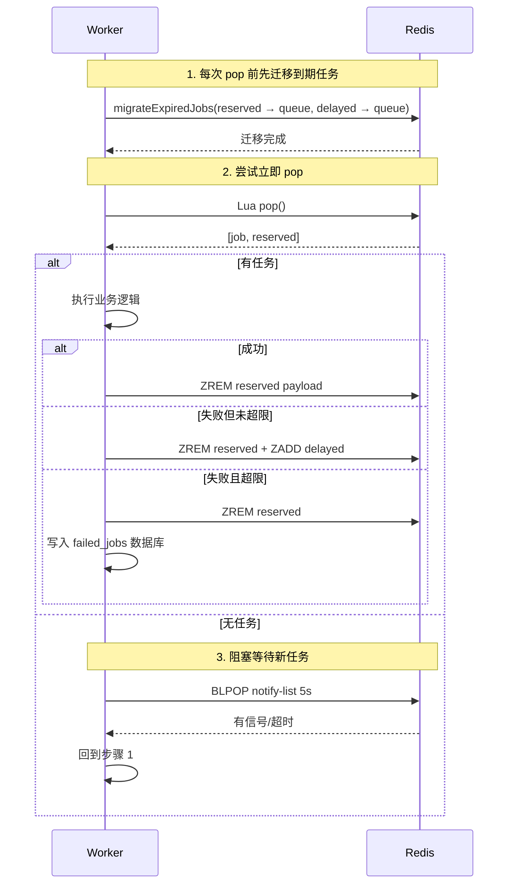
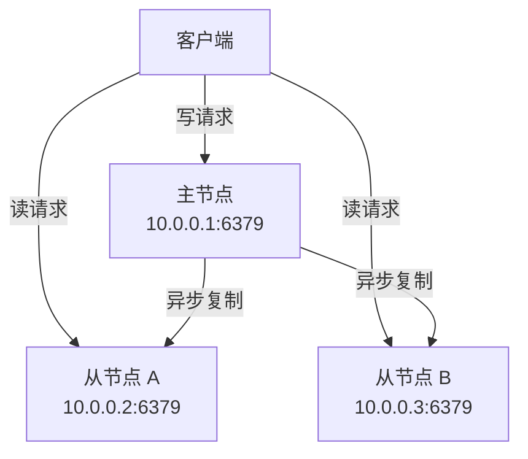
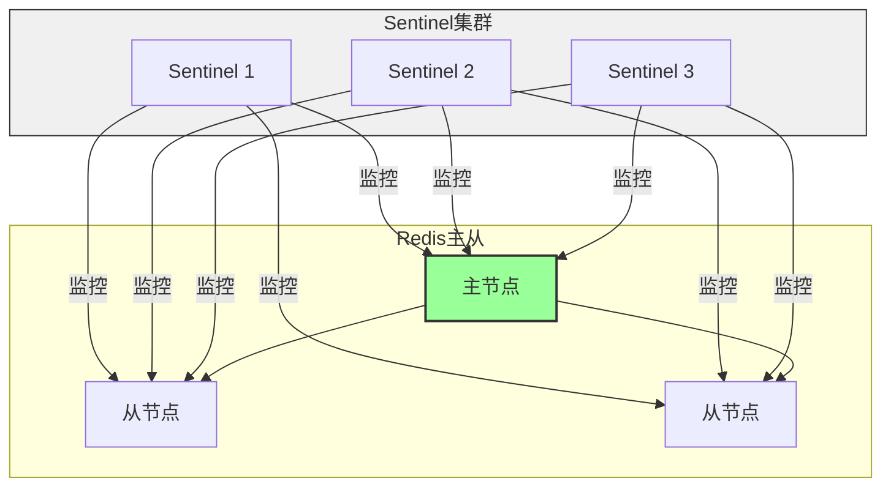
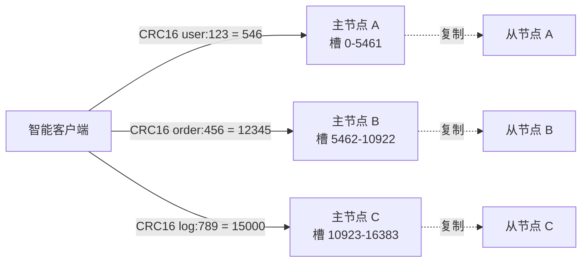

# 深入理解 Redis

Redis（Remote Dictionary Server）是一个开源的、基于内存的键值存储系统。它以极高的性能、丰富的数据结构和灵活的部署方式，成为现代分布式系统中不可或缺的基础设施。从缓存加速、异步队列到分布式锁，Redis 的身影无处不在。

以下从基础数据结构、核心架构设计，到三种队列实现机制与生产级集群方案，为你进行全面拆解。

---

## 1. 基础概念：Redis 的数据模型

Redis 不仅是简单的 Key-Value 存储，它的核心价值在于提供了丰富的**数据结构原语**，让开发者可以在同一个服务上构建多种业务场景。

| 数据类型 | 底层编码（默认/紧凑） | 核心用途 |
| --- | --- | --- |
| **String** | int / embstr / raw | 缓存、计数器、分布式锁、会话存储 |
| **List** | quicklist（3.2+） | 简单消息队列、最新动态列表、任务调度 |
| **Hash** | listpack / hashtable | 对象属性存储、用户信息、配置项 |
| **Set** | intset / hashtable | 标签、共同好友、去重、抽奖 |
| **ZSet** | listpack / skiplist | 排行榜、延迟队列、优先级任务 |
| **Bitmap** | 字符串位操作 | 用户签到、在线状态统计 |
| **HyperLogLog** | 概率算法 | UV/PV 去重统计（十亿级仅 12KB） |
| **Stream** | 基数树（radix tree）+ 哈希表 | 专业消息队列、消费者组、事件流 |

### 键的过期与淘汰策略

Redis 的内存毕竟有限，理解其淘汰机制至关重要：

* **过期时间：** 可以为任意 Key 设置 TTL（Time To Live），到期后自动删除。Redis 采用**惰性删除 + 定期删除**双策略保证时效性。
* **淘汰策略（maxmemory-policy）：** 当内存达到上限时，从设置了过期时间的 Key 或全量 Key 中选择淘汰：
  * `allkeys-lru` / `volatile-lru`：最近最少使用
  * `allkeys-lfu` / `volatile-lfu`：最不常使用（4.0+ 引入，比 LRU 更精准）
  * `allkeys-random` / `volatile-random`：随机淘汰
  * `volatile-ttl`：优先淘汰剩余 TTL 最短的
  * `noeviction`：不淘汰，写入报错（默认）

---

## 2. 核心架构：单线程 + I/O 多路复用的极致设计

Redis 之所以能达到单机 **10 万 QPS**，核心在于其精妙的架构选择。

### 单线程事件循环

Redis 的核心命令执行逻辑跑在**单线程**上，这带来了：

* **避免锁竞争：** 无需处理复杂的多线程同步问题，代码逻辑简单且安全。
* **内存操作高效：** Redis 的数据结构全在内存中，单线程顺序执行可以充分利用 CPU 缓存，避免线程上下文切换开销。
* **非阻塞 I/O：** 通过 I/O 多路复用器（Linux 下是 `epoll`，MacOS/FreeBSD 下是 `kqueue`），单线程可以同时监听数万个 Socket 连接。



### 6.0 版本的多线程 I/O 增强

Redis 6.0 引入了**多线程处理网络 I/O**的能力，但**命令执行仍然是单线程**：

* 主线程负责 Accept 连接，然后将读取请求分发给 I/O 线程
* I/O 线程完成读取后，主线程串行执行命令
* 主线程再将写响应分发给 I/O 线程发送

这种设计保持了命令执行的线程安全，同时利用多核提升了网络层吞吐。

### 持久化机制：RDB 与 AOF

Redis 提供两种持久化方案，生产环境通常混合使用：

| 维度 | RDB（快照） | AOF（追加文件） |
| --- | --- | --- |
| **原理** | 在某个时间点将内存数据序列化为二进制文件 | 每条写命令以协议格式追加到日志文件 |
| **数据安全** | 可能丢失最后一次快照后的写操作 | 丢数据窗口约 1 秒（取决于刷盘策略） |
| **恢复速度** | 快（直接加载二进制） | 慢（逐条重放命令） |
| **文件体积** | 小（紧凑二进制） | 大（可通过 bgrewriteaof 压缩） |
| **适用场景** | 冷备份、灾备传输、大数据量恢复 | 实时性要求高的业务 |

**推荐生产配置：** 开启 AOF（`appendonly yes`）+ `everysec` 刷盘策略 + `auto-aof-rewrite-percentage` 自动压缩，同时保留 RDB 作为兜底备份。

---

## 3. 队列实现详解：从简单到专业的五种方案

Redis 提供了五种队列实现方案，从内置的 List/Pub/Sub/Stream，到自实现的 Hash+ZSet+事务，再到 Laravel 框架的成熟工程化方案，满足不同复杂度的业务需求。

### 3.1 List：最简单的 FIFO 队列

Redis List 本质是**双向链表**，可以快速在两端插入和删除。

#### 核心命令

| 操作 | 命令 | 说明 |
| --- | --- | --- |
| **生产** | `LPUSH queue msg` / `RPUSH queue msg` | 从头部或尾部插入 |
| **消费（阻塞）** | `BRPOP queue timeout` / `BLPOP queue timeout` | 阻塞式弹出，队列为空时等待 timeout 秒 |
| **消费（非阻塞）** | `RPOP queue` / `LPOP queue` | 立即返回，无消息时返回 nil |
| **长度** | `LLEN queue` | 获取队列长度 |
| **删除** | `DEL queue` | 删除整个队列 |

#### 经典模式：生产者-消费者

```
生产者 → LPUSH task_queue "任务A" → [任务A, 任务B, 任务C] → BRPOP → 消费者
```

#### List 队列的局限性

* **无消费确认：** `BRPOP` 弹出即删除，消费者如果处理失败，消息直接丢失。
* **无消息回溯：** 消费过的消息无法再次获取。
* **单消费者语义：** 多个消费者竞争消费，无法精确分工（如按消息类型分流）。
* **内存风险：** 消息堆积会持续占用内存，OOM 后有丢失风险。

#### 典型应用场景

* **异步发送邮件/短信：** 对可靠性要求不高的一次性任务。
* **最新动态/Feed 流：** 关注的人的最新推文。
* **简单的串行任务调度：** 保证任务严格按顺序执行。

---

### 3.2 Pub/Sub：发布订阅模式

Redis Pub/Sub 是**广播式的消息系统**，与 List 的点对点不同，它支持一对多的消息分发。

#### 核心命令

| 操作 | 命令 | 说明 |
| --- | --- | --- |
| **发布** | `PUBLISH channel msg` | 向指定频道发布消息 |
| **订阅** | `SUBSCRIBE channel1 channel2` | 订阅一个或多个频道（阻塞） |
| **模式订阅** | `PSUBSCRIBE news.*` | 通配符模式匹配频道 |
| **取消订阅** | `UNSUBSCRIBE channel` / `PUNSUBSCRIBE` | 取消订阅 |



#### Pub/Sub 的致命缺陷

* **无持久化：** Redis 重启后所有订阅关系丢失，消息也不会保存。
* **离线消息丢失：** 消费者订阅前发布的消息会直接丢弃，无法回溯。
* **无 ACK 机制：** 消费者处理失败也不会通知生产者。

#### 典型应用场景

* **实时通知系统：** 在线人数、股票价格推送。
* **缓存失效广播：** 某个 Key 更新后通知所有客户端刷新本地缓存。
* **配置变更下发：** 配置中心推送新配置。

---

### 3.3 Stream：专业级消息队列（推荐生产使用）

Redis 5.0 引入的 **Stream** 是借鉴 Kafka 设计的内存消息队列，支持**消费组、消息持久化、ACK 确认**，是目前 Redis 中最专业的队列方案。

#### Stream 核心概念

| 组件 | 说明 |
| --- | --- |
| **Stream** | 消息流本体，类似 Kafka 的 Topic，每条消息有唯一 ID |
| **Consumer Group** | 消费组，类似 Kafka 的 Consumer Group，组内消费者分工消费 |
| **消息 ID** | 格式 `1640000000000-0`，时间戳 + 序列号，保证有序 |
| **Pending List** | 已投递但未确认的消息列表，防止消费失败丢失 |
| **PEL（Pending Entries List）** | 每个消费者的待确认消息集合 |

#### 核心命令速查

**生产者：**

| 命令 | 说明 |
| --- | --- |
| `XADD stream key value [MAXLEN ~ N]` | 追加消息，`~` 表示近似裁剪（性能更好） |
| `XTRIM stream MAXLEN ~ N` | 手动裁剪 Stream 长度 |
| `XLEN stream` | 获取 Stream 长度 |
| `XRANGE stream - + COUNT N` | 范围查询消息 |

**消费者组与消费：**

| 命令 | 说明 |
| --- | --- |
| `XGROUP CREATE stream groupname $ MKSTREAM` | 创建消费组，`$` 表示从最新消息开始消费 |
| `XREADGROUP GROUP group consumer STREAMS stream > COUNT N BLOCK timeout` | 消费组模式读取，`>` 表示从未投递过的新消息 |
| `XACK stream group msg_id1 msg_id2` | 确认消息处理完成，从 PEL 移除 |
| `XPENDING stream group` | 查看 Pending 列表（未确认消息） |
| `XCLAIM stream group consumer min-idle-time msg_id` | 将超时未确认的消息转交给其他消费者处理 |

**单消费者模式（无消费组）：**

| 命令 | 说明 |
| --- | --- |
| `XREAD STREAMS stream1 stream2 ID1 ID2 BLOCK timeout COUNT N` | 从指定 ID 之后读取，不维护状态 |

#### 消费组消息流转



#### Stream vs List 关键差异

| 维度 | List | Stream |
| --- | --- | --- |
| **消费确认** | 弹出即删，无确认 | XACK 确认，有 Pending 机制 |
| **消息回溯** | 不支持 | 支持，可通过 `XRANGE` 查看历史 |
| **消费组** | 无 | 原生支持，消费者分工明确 |
| **消息 ID** | 无（隐式队列顺序） | 显式 `时间戳-序列号`，可精确定位 |
| **自动裁剪** | 无（需应用层控制） | `MAXLEN ~ N` 自动裁剪 |
| **内存安全** | 易溢出 | 支持自动限流裁剪 |

---

### 3.4 进阶方案：Hash + ZSet + 事务实现可 ACK 队列

如果你的 Redis 版本低于 5.0（没有 Stream），或者需要比 Stream 更灵活的**自定义 ACK、重试、延迟消费、死信处理**，可以用 **Hash + ZSet + `MULTI/EXEC` 事务**手工构建一个专业级消息队列。这是面试中的高频考点，也是很多生产系统的实际做法。

#### 核心设计思路

| Redis 数据结构 | 角色 | 说明 |
| --- | --- | --- |
| **Hash** (`msg:content:{msgId}`) | 存储消息实际内容 | 每条消息一个 Hash，字段包括 payload、重试次数、创建时间等 |
| **ZSet** (`queue:pending`) | 待消费队列 | score = 消息入队时间戳，member = 消息 ID |
| **ZSet** (`queue:processing`) | 处理中队列 | score = 进入处理的时间戳，member = 消息 ID（用于超时检测） |

三个结构配合 `MULTI/EXEC` 事务，实现**原子性的入队、出队、ACK、NACK**。

#### 四步核心操作

##### Enqueue：原子入队

```redis
MULTI
    HSET msg:content:msg_123 payload '{"orderId": 999}' retry_count 0 created_at 1700000000
    ZADD queue:pending 1700000000 msg_123
EXEC
```

两个命令必须在一个事务中执行，保证：**要么消息内容和队列条目同时存在，要么都不存在**。

**Hash 字段说明：**

| 字段 | 含义 | 为什么需要 |
| --- | --- | --- |
| `payload` | 消息实际内容（通常是 JSON） | 核心业务数据 |
| `retry_count` | 消费失败的重试次数，初始为 **0** | 防止一条永远处理不了的消息被无限重试，需要一个计数器来判断是否进入死信队列 |
| `created_at` | 消息创建时间戳 | 用于日志追踪和延迟计算 |

> **为什么 retry_count 初始设为 0？** 因为消息入队时尚未被消费过。只有当消费者 NACK（消费失败，见下文 NACK 部分）时才会通过 `HINCRBY retry_count 1` 递增。当 retry_count 达到阈值（通常 3 次），这条消息就不再放回 pending 队列，而是进入死信队列等待人工处理。

##### Dequeue：原子出队（从 pending 移到 processing）

```redis
# 第一步：找出最早待消费的消息（score 最小 = 最早入队）
ZRANGE queue:pending 0 0

# 第二步：原子地从 pending 移除，同时加入 processing
# 注意：用 Lua 脚本或 MULTI/EXEC 保证这两步的原子性
MULTI
    ZREM queue:pending msg_123
    ZADD queue:processing 1700000100 msg_123   # score = 当前时间戳
EXEC

# 第三步：读取消息内容
HGETALL msg:content:msg_123
```



##### ACK：确认消费完成（从 processing 移除 + 清理 Hash）

```redis
MULTI
    ZREM queue:processing msg_123
    DEL msg:content:msg_123
EXEC
```

##### NACK：拒绝消费（放回 pending 或进入死信）

```redis
# 方案 A：放回队列头部重试
MULTI
    ZREM queue:processing msg_123
    HINCRBY msg:content:msg_123 retry_count 1
    ZADD queue:pending 1700000000 msg_123   # 原时间戳或延迟时间
EXEC

# 方案 B：重试次数超限，进入死信队列
HGET msg:content:msg_123 retry_count
# 如果 retry_count >= 3
MULTI
    ZREM queue:processing msg_123
    ZADD queue:dead_letter 1700000000 msg_123
EXEC
```

#### 宕机恢复：超时消息回收

消费者处理消息后宕机，ACK 永远不会到达。通过 `queue:processing` 的 score（进入处理的时间戳）可以识别超时消息：

```redis
# 找出超过 60 秒未确认的消息（score < now - 60）
ZRANGEBYSCORE queue:processing 0 1699999940

# 将它们放回 pending 队列（原子操作）
MULTI
    ZREM queue:processing msg_stuck_1
    ZADD queue:pending 1700000000 msg_stuck_1
EXEC
```

一个独立的**看门狗线程/定时任务**每隔 N 秒执行这个回收逻辑，确保消息不会因消费者宕机而永久丢失。

#### 为什么需要 MULTI/EXEC？

| 如果不用事务 | 后果 |
| --- | --- |
| `ZADD queue:pending` 成功但 `HSET` 失败 | 队列有 msg_123，但没有消息内容 → **消息无法消费** |
| `ZREM pending` 成功但 `ZADD processing` 失败 | 消息从 pending 消失但不在 processing → **消息永久丢失** |
| `ZREM processing` 成功但 `DEL hash` 失败 | 消息确认了但残留 Hash → **内存泄漏** |

**MULTI/EXEC 保证了每组操作要么全部成功，要么全部回滚**，这是整个方案可靠性的基石。

#### 优缺点对比

| 维度 | Hash+ZSet 自实现队列 | Redis Stream |
| --- | --- | --- |
| **Redis 版本** | 2.6+（所有版本支持） | 5.0+ |
| **ACK 机制** | 自己实现（processing ZSet） | 原生 Pending List |
| **消费组** | 无（需要自己扩展） | 原生支持 |
| **消息回溯** | 可以（不删除 Hash） | 原生支持 |
| **灵活性** | ⭐⭐⭐⭐⭐（自定义重试/死信/延迟） | ⭐⭐⭐⭐（标准但有局限） |
| **代码复杂度** | 较高（需要处理超时恢复、幂等） | 低（XREADGROUP + XACK 即可） |
| **事务保证** | 依赖 MULTI/EXEC（无法跨节点） | 原生单命令原子 |
| **消息覆盖** | ⭐⭐⭐⭐⭐（天然支持，见下文） | ❌ 不支持（XADD 自动生成 ID） |
| **延迟队列** | 需自己实现 | 不原生支持（可用 XADD + 过期 XREADGROUP） |

#### 独有特性：天然支持消息覆盖（幂等入队）

Hash+ZSet 方案相比其他四种方案，有一个**独有的核心能力——幂等/覆盖式入队**。这在业务数据会**频繁更新**的场景下至关重要。

##### 场景举例

> 订单 `order_999` 的状态从 `pending → paid → shipped → completed` 会变更 4 次。每次变更都需要投递一条消息给库存服务、物流服务。如果库存服务还没消费到 `paid` 那条，订单就已经变成 `shipped` 了——我们**不希望库存服务收到两条消息**（先 paid 再 shipped，等于减了两次库存），而是希望**消息被覆盖**（只收到 shipped 那条）。

##### 为什么其他方案都做不到？

| 方案 | 为什么不支持覆盖 |
| --- | --- |
| **List** | 只能追加到尾部，无法在 List 中定位并替换某条消息 |
| **Pub/Sub** | 广播出去就没了，无持久化，根本没有"覆盖"的概念 |
| **Stream** | `XADD` 自动生成消息 ID（时间戳-序列号），你无法指定"覆盖某个 ID"；Stream 只能追加 |
| **Laravel RedisQueue** | 整个 payload JSON 直接塞进 List/ZSet 当 value，没有独立可寻址的 key 来定位替换 |
| **Hash+ZSet ✅** | 消息内容存在独立 Hash key（`msg:content:{业务ID}`）中，`HSET` 本身就是覆盖语义 |

##### 覆盖的工作原理

核心只有一个：**用业务主键（而非随机 UUID）作为消息 ID**。

```redis
# 第一次入队：订单状态 paid
MULTI
    HSET msg:content:order_999 payload '{"status":"paid"}' retry_count 0
    ZADD queue:pending 1700000000 order_999
EXEC
# → ✅ 正常入队

# 第二次入队：订单状态 shipped（覆盖 paid）
MULTI
    HSET msg:content:order_999 payload '{"status":"shipped"}' retry_count 0  # ← HSET 覆盖 payload
    ZADD queue:pending 1700000100 order_999                                     # ← ZADD 更新 score（如果 order_999 已在 ZSet 中）
EXEC
# → ✅ Hash 内容被覆盖，ZSet 的 score 被更新（位置前移/后移）
```

**关键点：**

1. **`HSET` 覆盖** — Hash 的 key 是 `msg:content:order_999`，同一个 key 再次 HSET 就是覆盖原有内容
2. **`ZADD` 更新 score** — ZSet 的 member 是 `order_999`，同一个 member 再次 ZADD 只会更新 score，不会重复添加
3. **消费者看到的永远是最新 payload** — 不管生产者入队多少次，消费者 `HGETALL msg:content:order_999` 拿到的永远是最后一次 HSET 的内容

##### 覆盖时机：三种情况



| 覆盖时机 | 行为 | 是否产生重复消费？ |
| --- | --- | --- |
| **消息还没被消费（在 pending ZSet 中）** | Hash payload 被覆盖，ZSet score 被更新 | ❌ 不会，消费者只看到最新内容 |
| **消息正在被消费（在 processing ZSet 中）** | Hash payload 被覆盖，但 processing ZSet 里已有 member | ⚠️ 可能有问题，需要业务层处理（见下方注意事项） |
| **消息已消费完成（已 ACK）** | Hash 已被删除，HSET 重新创建 | ✅ 这是**全新的入队**，正常消费 |

##### 注意事项

覆盖方案有一个边界情况需要注意：

> **如果消费者已经从 pending 移动到 processing（正在处理），生产者又覆盖了 Hash 内容，此时消费者 HGETALL 拿到的是新 payload，但它之前看到的是旧 payload 的副本。**

解决办法：

| 办法 | 说明 |
| --- | --- |
| **消费者处理前先读取 Hash** | 不要缓存 payload，每次处理前重新 `HGETALL`，拿到的一定是最新的 |
| **版本号/时间戳比对** | payload 里加一个 `version` 或 `updated_at` 字段，消费者处理前比对自己看到的版本和 Hash 里的最新版本 |
| **业务层控制** | 对于要求严格顺序的场景（如订单状态机），用 Redis 分布式锁或数据库事务保证"只有上一状态正确的消息才能被消费" |

##### 实战对比：为什么这是核心差异

| 场景 | Hash+ZSet 覆盖 | List/Stream/Laravel 追加 | 哪个更好？ |
| --- | --- | --- | --- |
| **订单状态频繁变更** | 消息覆盖，消费者只收到最终状态 | 消费者收到 N 条中间状态消息，需自行过滤 | ✅ 覆盖更优 |
| **用户资料更新推送** | 最后一次更新覆盖前面的，下游只处理最新版 | 下游依次处理所有旧版本，可能覆盖新数据 | ✅ 覆盖更优 |
| **事件审计** | 丢失中间状态（如果审计需要完整轨迹） | 完整保留所有变更历史 | ✅ 追加更优 |

**结论：** 如果你的业务需要**事件溯源/审计**——选追加式（Stream 最适合）；如果你的业务需要**最终一致性、最新值覆盖**——Hash+ZSet 自实现方案是 Redis 队列里唯一能做到的。

#### 关键限制

这个方案和 Redis Stream 一样，受到 **Redis Cluster Key 独占**的限制：**三个结构（Hash + 两个 ZSet）必须在同一个节点上**，否则 MULTI/EXEC 会报 `CROSSSLOT`。

解决办法：用 **Hash Tag** 强制三个 Key 同槽：
```redis
# 用同一个 Hash Tag {myqueue} 让三个 Key 在同一个节点
{myqueue}:pending
{myqueue}:processing
{myqueue}:content:msg_123
```

---

### 3.5 实战案例：Laravel RedisQueue 的工程化设计

上面 3.4 节展示的 Hash+ZSet+MULTI/EXEC 是最通用的从零构建方案。但在实际生产框架中，Laravel 对这个设计做了大量**工程化优化**，是目前 PHP 生态中最成熟的 Redis 队列实现之一。

> **注意：Laravel Horizon 是监控面板和 Worker 配置管理器，并不改变队列底层实现。真正的队列逻辑在框架核心 `Illuminate\Queue\RedisQueue` 中。**

#### 核心架构：4 个 Key 搞定一切

Laravel **不拆分 Hash**，直接把整个任务的 JSON payload 当作 value 存在 List 或 ZSet 中。用 4 个 Redis Key 覆盖了主队列、延迟队列、处理中队列和阻塞通知。

| Redis Key 模式 | 类型 | 命令 | 作用 |
| --- | --- | --- | --- |
| `queues:{name}` | **List** | `RPUSH` / `LPOP` | **主队列**：待消费任务，FIFO 顺序 |
| `queues:{name}:delayed` | **ZSet** | `ZADD` / `ZRANGEBYSCORE` | **延迟队列**：score = 到期时间戳 |
| `queues:{name}:reserved` | **ZSet** | `ZADD` / `ZREM` | **处理中队列**：score = **超时点**（`now + retryAfter`） |
| `queues:{name}:notify` | **List** | `RPUSH` / `BLPOP` | **通知列表**：Worker 阻塞等待信号，避免轮询 |

#### 为什么 Laravel 用 Lua 脚本而不是 MULTI/EXEC？

`MULTI/EXEC` 只能做"要么全成要么全败"的批量操作，**不能做条件判断**。但队列的 pop 操作本质是：

```
if (主队列有消息) {
    弹出 → 放入 reserved ZSet → 清除 notify 信号
} else {
    返回空
}
```

这种**带条件的多步原子操作**，只有 Lua 脚本能实现。Laravel 的所有核心操作都封装在 Lua 脚本中（见 `Illuminate\Queue\LuaScripts`）。

#### 核心 Lua 脚本解析

##### Push（入队）

```lua
-- KEYS[1] = queues:default（主队列）
-- KEYS[2] = queues:default:notify（通知列表）
-- ARGV[1] = 完整的任务 JSON payload

redis.call('rpush', KEYS[1], ARGV[1])      -- 任务入队
redis.call('rpush', KEYS[2], 1)             -- 塞一个通知信号
```

**为什么还要 `:notify`？** 让 Worker 用 `BLPOP queues:default:notify timeout` **阻塞等待**新任务，避免 Worker 空转轮询浪费 CPU。

##### Pop（出队）

```lua
-- KEYS[1] = queues:default（主队列）
-- KEYS[2] = queues:default:reserved（处理中队列）
-- KEYS[3] = queues:default:notify
-- ARGV[1] = now + retryAfter（reserved 的 score，超时点）

local job = redis.call('lpop', KEYS[1])
local reserved = false

if(job ~= false) then
    reserved = cjson.decode(job)
    reserved['attempts'] = reserved['attempts'] + 1  -- attempts 就是 retry_count！
    reserved = cjson.encode(reserved)
    redis.call('zadd', KEYS[2], ARGV[1], reserved)  -- 原子放入 reserved
    redis.call('lpop', KEYS[3])                       -- 清除 notify 信号
end

return {job, reserved}
```

**关键设计点：**
- **`reserved` ZSet 的 score 存超时点而非进入时间**：`ARGV[1] = now + retryAfter`，迁移时直接 `ZRANGEBYSCORE reserved -inf now` 就能查出所有超时任务，比我们方案存进入时间再算差值更优雅
- **`attempts` 存 payload JSON 里**：不单独用 Hash，省了一次额外的 `HGETALL` 读取

##### Migrate Expired（定时迁移）

Laravel 的 Worker 每次 pop 前都会先调用这个脚本，把 `delayed` 和 `reserved` 里到期的任务搬回主队列：

```lua
-- KEYS[1] = 到期的 ZSet（delayed 或 reserved）
-- KEYS[2] = 主队列
-- KEYS[3] = notify 列表
-- ARGV[1] = 当前时间戳
-- ARGV[2] = 批量大小

local val = redis.call('zrangebyscore', KEYS[1], '-inf', ARGV[1], 'limit', 0, ARGV[2])
if(next(val) ~= nil) then
    redis.call('zremrangebyrank', KEYS[1], 0, #val - 1)
    for i = 1, #val, 100 do
        redis.call('rpush', KEYS[2], unpack(val, i, math.min(i+99, #val)))
        for j = i, math.min(i+99, #val) do
            redis.call('rpush', KEYS[3], 1)  -- 每条任务都触发一个 notify
        end
    end
end
return val
```

##### Release（显式释放）

消费者可以主动调用 `deleteAndRelease` 释放任务放回延迟队列（比如业务逻辑需要稍后重试）：

```lua
-- KEYS[1] = delayed ZSet
-- KEYS[2] = reserved ZSet
-- ARGV[1] = 完整 payload
-- ARGV[2] = 新的到期时间戳

redis.call('zrem', KEYS[2], ARGV[1])           -- 从 reserved 移除
redis.call('zadd', KEYS[1], ARGV[2], ARGV[1])   -- 放入 delayed，稍后再试
```

#### Worker 阻塞消费流程



#### 和 3.4 节 Hash+ZSet 方案的对比

| 维度 | 3.4 节 Hash+ZSet+MULTI/EXEC | 3.5 节 Laravel List+ZSet+Lua |
| --- | --- | --- |
| **消息存储** | Hash 存 payload + ZSet 存 ID | **整个 JSON payload 直接存在 List/ZSet**，不拆分 |
| **原子性保证** | `MULTI/EXEC` 事务（批量操作） | **Lua 脚本**（带条件的原子操作，功能更强） |
| **retry_count** | Hash 独立字段 `retry_count` | payload JSON 内的 `attempts` 字段 |
| **通知机制** | 无（轮询或外部实现） | **`:notify` List + `BLPOP` 阻塞**，不浪费 CPU |
| **延迟队列** | 无（需自己写） | 原生 `:delayed` ZSet，`later()` 直接用 |
| **reserved score 含义** | 进入时间戳（需算差值判断超时） | **超时点** `now + retryAfter`（可直接比较） |
| **代码复杂度** | 约 100 行 Redis 命令 | 约 150 行 Lua 脚本 + Worker 逻辑 |
| **适用框架** | 通用（任何语言都能实现） | **PHP/Laravel 生态**，可直接用 `queue:work` |

#### 设计哲学总结

Laravel RedisQueue 的设计思路可以归纳为：

> **简单但够用的结构 + Lua 脚本保证原子性 + 阻塞通知降低空转**

和我们手写的 Hash+ZSet 方案相比，它少了 Hash 这层拆分，多了 Lua 脚本的条件判断能力，还加了一个 `BLPOP` 通知机制。这三处改进让它从"理论上可行"变成了"生产级好用"。

但要注意，Laravel 这套方案同样受到 **Redis Cluster Key 独占**的限制——4 个 Key 必须在同一个节点上。Laravel 的官方文档也明确说明了：使用 Cluster 时队列名必须带 Hash Tag（如 `queue => '{default}'`）。

---

## 4. 集群实现：从主从到分片

### 4.1 主从复制（Replication）

Redis 主从模式是最基础的高可用方案：

* **主节点（Master）：** 负责处理客户端的写操作，异步同步数据给从节点。
* **从节点（Slave/Replica）：** 默认只读，分担主节点的读压力。
* **全量同步 vs 增量同步：** 初次同步通过 RDB + 后续增量 AOF；后续同步仅传命令流。



**主从痛点：** 主节点故障时需要手动切换，缺乏自动化故障转移。

### 4.2 哨兵模式（Sentinel）

Sentinel 是 Redis 官方提供的**高可用解决方案**，由一组 Sentinel 进程监控 Redis 主从集群：

| Sentinel 核心能力 | 说明 |
| --- | --- |
| **监控（Monitoring）** | 持续向主从节点发送 PING 检测存活 |
| **通知（Notification）** | 节点故障时通过 API 或邮箱通知管理员 |
| **自动故障转移** | 主节点下线后，自动将从节点升级为新主 |
| **配置提供者** | 客户端通过 Sentinel 发现当前主节点地址 |

**最佳实践：** 至少部署 3 个 Sentinel 实例，避免**单哨兵挂掉**或**脑裂问题**。



### 4.3 Redis Cluster（分片集群）

当单节点内存上限成为瓶颈时，**Redis Cluster** 提供了原生的水平扩展方案。

#### 核心机制

* **16384 个槽位（Slot）：** 整个集群的键空间被划分为 0~16383 共 16384 个哈希槽。
* **CRC16 哈希：** Key 经过 `CRC16(key) % 16384` 计算后，决定属于哪个槽。
* **槽位分配给节点：** 每个主节点负责一部分槽，例如 3 主 3 从架构下每个主节点约 5461 个槽。
* **MOVED 重定向：** 客户端如果连接到了不负责该 Key 的节点，节点返回 `MOVED` 错误告知正确节点，智能客户端自动跳转。

> **⚠️ 关键事实：每个 Key 只在一个主节点上**
>
> Redis Cluster 采用**分片（Sharding）**模式而非**复制（Replication）**模式。通过 CRC16 哈希后，**每个 Key 精确地映射到一个槽位，该槽位在某一个主节点上**。这意味着：
>
> 1. **一个 Key 不会同时存在于多个主节点上**——Redis Cluster 是分片集群，不是多主复制集群。一个 Key 的数据只有一份（加上该槽位对应主节点的从节点副本用于高可用）。
> 2. **多 Key 操作受限**——`MULTI/EXEC`、`MGET`、`PIPELINE` 等需要原子或批量操作多个 Key 的命令，**要求所有 Key 必须在同一个节点上**，否则会报 `CROSSSLOT` 错误。
> 3. **Stream 的局限**——Redis Stream 同样遵循这个规则：一个 Stream Key 完全位于一个槽位上，不能跨节点分片；Stream 的消费组也无法跨槽。这与 Kafka 的 Topic 天然支持跨节点 Partition 是本质差异。
> 4. **从节点是只读副本**——从节点上的数据只是主节点的异步副本，不接受写请求，也不改变"一个 Key 只在一个主节点"这一事实。



#### Hash Tag：强制同槽

某些场景需要多个 Key 在同一个节点（如 `MULTI/EXEC` 事务、Pipeline），可以使用 **Hash Tag**：

```redis
{user:123}:profile   // 只计算 {user:123} 部分的哈希
{user:123}:cart      // 与上面同槽！
```

#### Cluster 的关键限制

| 限制 | 原因 | 解决办法 |
| --- | --- | --- |
| 跨槽 Key 不支持事务 | MULTI/EXEC 必须在同一节点 | Hash Tag 强制同槽 |
| `SELECT` 命令被禁用 | Cluster 不支持多数据库 | — |
| `DBSIZE` 等全局命令受限 | 分布式下无法原子统计 | 客户端聚合各节点结果 |
| 扩容需要 rehash | 槽位迁移是渐进过程 | `redis-cli --cluster add-node` |

---

## 5. 实际应用场景

| 场景 | Redis 的作用 | 关键技术 |
| --- | --- | --- |
| **分布式缓存** | 减轻数据库压力，提升接口响应 | Cache-Aside 模式 + LRU 淘汰 + 布隆过滤器防穿透 |
| **分布式锁** | 保证跨进程的互斥访问 | `SET key value NX PX timeout` + Redisson 可重入锁 |
| **限流** | 接口流量控制 | ZSet 滑动窗口 / INCR 计数器 |
| **排行榜** | 实时排名 | ZSet（ZADD + ZREVRANGE） |
| **发布/点赞** | 社交互动 | Set 存储点赞用户 ID + ZSet 按时间排序 |
| **验证码/Token** | 短期存储验证信息 | String + TTL 自动过期 |
| **延迟队列** | 订单超时、定时任务 | ZSet 存储到期时间戳 + 定时扫描 |
| **消息队列** | 异步解耦 | Stream（推荐）/ List（简单场景） |

---

## 6. Redis vs 其他队列方案选型

回到 [消息队列技术选型对比]() 中提到的观点：

* **极简场景选 List：** 异步邮件、计数器更新，开发 5 分钟搞定。
* **需要消费组选 Stream：** 可靠性比 List 高，支持消息回溯，但要注意内存上限。
* **核心业务选 RabbitMQ：** 需要事务、路由复杂、100% 不丢。
* **大数据量选 Kafka：** 百万级吞吐、磁盘持久化、事件溯源。

Redis 的核心定位是**内存数据库**，队列只是其众多能力之一。在选择 Redis 作为队列时，始终要记得它的**内存本质**——消息堆积就是内存堆积。